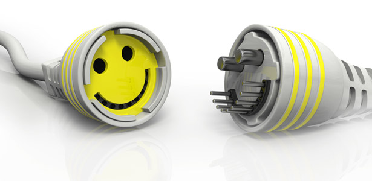

```{r load libraries, warning=FALSE, message=FALSE}
library(tm)
library(tidytext)
library(tidyverse)
library(DT)
library(tidyverse)
library(tidytext)
library(DT)
library(scales)
library(wordcloud2)
library(gridExtra)
library(ngram)
library(shiny) 
library(wordcloud)
library(knitr)
library(easyGgplot2)
```

###Is Technology Making Millennials More Happy Than Human Interation?
 
 

About a year ago Forbes Magazine published an article titled “Why Millennials are Lonely".  It claimed that “The second reason for millennial loneliness is the Internet makes it viral” effect. It emphasizes that “It’s not a coincidence that loneliness began to surge two years after Apple launched its first commercial personal computer and five years before Tim Berners-Lee invented the World Wide Web.”  This is a narrative that is seen across major media organizations like New York Times and NPR. These mediums often use representations of millennials as people always on their phone with no touch with the outside world. It is also commonly believed that, millennials don’t want relationships as pointed out by the Huffington Post, almost pointing at a lack of need of human touch by millennials.  But are millenials as lonely as they claim? Is technology the main cause this loneliness? Are millennials not attracted to human touch anymore? Let’s find out. 

I looked through a database (happyDB) to identify what made people happy. I then selected a group of millennials(generation y), generation x and generation z as defined by the Pew Research Center. Genertion x as people between the ages of 38 and 53. Generation y as people between the ages of 22 and 37. And generation Z as people between the age of 1 and 21. 

```{r load data, warning=FALSE, message=FALSE}
# Step 1 - Load the processed text data along with demographic information on contributors

# We use the processed data for our analysis and combine it with the demographic information available.
hm_data1 <- read_csv("../output/processed_moments.csv")
hm_data2 <- read_csv("../output/processed_moments.csv")
urlfile<-'https://raw.githubusercontent.com/rit-public/HappyDB/master/happydb/data/demographic.csv'
demo_data1 <- read_csv(urlfile)
demo_data2 <- read_csv(urlfile)
#print(hm_data)
```

```{r combining data, warning=FALSE, message=FALSE}

hm_data2 <- hm_data2 %>%
  inner_join(demo_data2, by = "wid") %>%
  select(wid,
         original_hm,
         gender, 
         marital, 
         parenthood,
         reflection_period,
         age, 
         country, 
         ground_truth_category, 
         text) %>%
  mutate(count = sapply(hm_data2$text, wordcount)) %>%
  filter(gender %in% c("m", "f")) %>%
  filter(marital %in% c("single", "married")) %>%
  filter(parenthood %in% c("n", "y")) %>%
  filter(reflection_period %in% c("24h", "3m")) %>%
  mutate(reflection_period = fct_recode(reflection_period, 
                                        months_3 = "3m", hours_24 = "24h"))
#print(hm_data2)
```


```{r warning=FALSE, message=FALSE}
#datatable(hm_data2)
```


```{r bigram, warning=FALSE, message=FALSE}
#Create bigrams using the text data
hm_bigrams2 <- hm_data2 %>%
  filter(count != 1) %>%
  unnest_tokens(bigram, text, token = "ngrams", n = 2)

bigram_counts2 <- hm_bigrams2 %>%
  separate(bigram, c("word1", "word2"), sep = " ") %>%
  count(word1, word2, sort = TRUE)
```

```{r, warning=FALSE, message=FALSE}
#Create a data set with non-millenials
hm_data2$age <- as.numeric(as.character(hm_data2$age))

generationZ<-hm_data2 %>% 
  filter(age>=1 & age<=21) 
#print(generationZ)

generationY<-hm_data2 %>% 
  filter(age>=22 & age<=37)
#print(generationY)

generationX<-hm_data2 %>% 
  filter(age>=38 & age<=53) 
#print(generationX)
# dim(generationX) 14560    11
# dim(generationY)70233    11
# dim(generationZ) 5540   11
```


```{r bag of words, warning=FALSE, message=FALSE}
### Create a bag of words using the text data

bag_of_words1 <-generationX %>%
  unnest_tokens(word, text)

word_count1 <- bag_of_words1 %>%
  count(word, sort = TRUE)

bag_of_words2 <-  generationY %>%
  unnest_tokens(word, text)

word_count2 <- bag_of_words2 %>%
  count(word, sort = TRUE)

bag_of_words3 <-generationZ %>%
  unnest_tokens(word, text)

word_count3 <- bag_of_words3 %>%
  count(word, sort = TRUE)
```
## Genration X##
```{r, warning=FALSE, message=FALSE}
set.seed(1234)
wordcloud(words = word_count1$word, freq = word_count1$n, min.freq = 1,
          max.words=10000, random.order=FALSE, rot.per=0.35, 
          colors=brewer.pal(8, "Paired"), main="Generation X")
```
For generation X, we seee that there is an emphasis on time and day which can be due to the period in their lives. They are older people, perhaps with different priorities. We can also see that a many of the things that generated happiness were family members. 
## Genration Y##
```{r, warning=FALSE, message=FALSE}
set.seed(1234)
wordcloud(words = word_count2$word, freq = word_count2$n, min.freq = 1,
          max.words=10000, random.order=FALSE, rot.per=0.35, 
          colors=brewer.pal(8, "Dark2"), main="Generation Y")
```
For generation Y aka the millenials,we can see that there is a commonality in the things that bring them happines. Friends, day , and time seem to be the predominant sources of happiness. There is more in common in the sources of happiness between older and younger generations that is led on by current media. If we look at older millenials( married ones), we can see that family aspect surging on, signaling to the differences being rooted in on the stages of their lives that the person is at not necessarily a generational issue. 

```{r}
#names(hm_data2)
singles<-hm_data2 %>% 
  select(wid, original_hm, gender, marital, parenthood, reflection_period, age, country, ground_truth_category, text, count) %>%
  filter(marital == "single")

bag_of_words_s <-singles %>%
  unnest_tokens(word, text)

word_count_s <- bag_of_words_s %>%
  count(word, sort = TRUE)
mod_word_count_s<-head(word_count_s, n=10)
ggplot2.barplot(data=mod_word_count_s, xName="word",yName='n',xtickLabelRotation=90,backgroundColor="green", fill='green',color="blue", ytitle="Frequency", xtitle="Words", mainTitle="What Makes Single Millenials Happy")

married<-hm_data2 %>% 
  select(wid, original_hm, gender, marital, parenthood, reflection_period, age, country, ground_truth_category, text, count) %>%
  filter(marital == "married" & age<37 & age>21)

bag_of_words_m <-married %>%
  unnest_tokens(word, text)

word_count_m <- bag_of_words_m %>%
  count(word, sort = TRUE)
mod_word_count_m<-head(word_count_m, n=10)
ggplot2.barplot(data=mod_word_count_m, xName="word",yName='n',xtickLabelRotation=90,backgroundColor="yellow", fill='yellow',color="blue", ytitle="Frequency", xtitle="Words", mainTitle="What Makes Married Millenials Happy")

```
The married millenials graphs shows us that 50% of the top ten words are related to family  something that is also present in the generation X graphs.  
## Genration Z##  
```{r, warning=FALSE, message=FALSE}
set.seed(1234)
wordcloud(words = word_count3$word, freq = word_count3$n, min.freq = 1,
          max.words=10000, random.order=FALSE, rot.per=0.35, 
          colors=brewer.pal(8, "Set1") ,main="Generation Z")

```
The word clous above shows that the most common source of happiness on those 24hours in the lives of millennials were their friends. Out of 72, 060 Millennials that answered the survey, over 8,000 of then included friends and family as their top reason for their happiness. This leads to shy away from these millenial perception of loneliness. 
```{r, warning=FALSE}
# install.packages("devtools")
library(devtools)

mod_word_count1<-head(word_count1, n=10)
mod_word_count2<-head(word_count2, n=10)
mod_word_count3<-head(word_count3, n=10)
 #print(mod_word_count)
# barplot(mod_word_count)
library(easyGgplot2)
ggplot2.barplot(data=mod_word_count1, xName="word",yName='n',xtickLabelRotation=90,backgroundColor="lightyellow", fill='green',color="blue", ytitle="Frequency", xtitle="Words", mainTitle="Top 10 Words Used by Generation X")

ggplot2.barplot(data=mod_word_count2, xName="word",yName='n',xtickLabelRotation=90,backgroundColor="lightblue", fill='green',color="blue", ytitle="Frequency", xtitle="Words", mainTitle="Top 10 Words Used by Generation Y (Millenials)")

ggplot2.barplot(data=mod_word_count3, xName="word",yName='n',xtickLabelRotation=90,backgroundColor="lightpink", fill='green',color="blue", ytitle="Frequency", xtitle="Words", mainTitle="Top 10 Words Used by Generation Z")

```
  The most commonly used word by millenials and generation Z is friend indicating that there still a predominant human interaction.  It only differs by stage of life a person finds themselves in. 

```{r, warning=FALSE, message=FALSE}
# library(easyGgplot2)
# ggplot2.barplot(data=mod_word_count1, xName="word",yName='(n/14560)*100',xtickLabelRotation=90,backgroundColor="lightyellow", fill='green',color="blue", ytitle="Percentage", xtitle="Words", mainTitle="Top 10 Words Used by Generation X")
# 
# ggplot2.barplot(data=mod_word_count2, xName="word",yName='(n/70233)*100',xtickLabelRotation=90,backgroundColor="lightblue", fill='green',color="blue", ytitle="Percentage", xtitle="Words", mainTitle="Top 10 Words Used by Generation Y (Millenials)")
# 
# ggplot2.barplot(data=mod_word_count3, xName="word",yName='(n/5540)*100',xtickLabelRotation=90,backgroundColor="lightpink", fill='green',color="blue", ytitle="Percentage", xtitle="Words", mainTitle="Top 10 Words Used by Generation Z")

```

